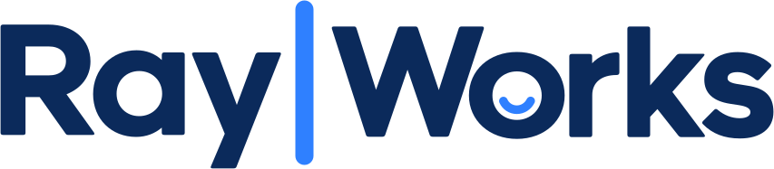
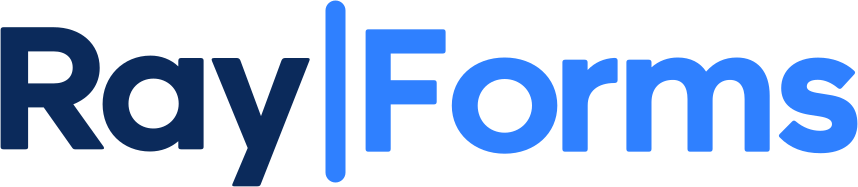

<div align="center">

<picture>
  <source media="(prefers-color-scheme: dark)" srcset="./docs/logos/rayworks-dark.svg">
  <source media="(prefers-color-scheme: light)" srcset="./docs/logos/rayworks.svg">
  
</picture>

**A collection of focused enterprise applications built for Microsoft Fabric.**

[](https://github.com/features/copilot)
[](https://learn.microsoft.com/en-us/fabric/apps/overview)
[](https://aka.ms/rayfin/docs)
[](https://www.typescriptlang.org/)

[Applications](#applications) &middot;
[Getting started](#getting-started) &middot;
[More resources](#more-resources)

</div>

## Overview

Ray|Works explores what enterprise data can become beyond dashboards. Built with
[Microsoft Fabric Apps](https://learn.microsoft.com/en-us/fabric/apps/overview) and
[Project Rayfin](https://aka.ms/rayfin/docs), this collection turns Fabric data into interactive
applications and practical workflows—from live audience engagement and forms to AI-assisted
reporting and data-driven presentations. Together, these examples show how developers can blur
the line between analytics and software to create entirely new experiences on enterprise data.

## Applications

<table>
  <thead>
    <tr>
      <th>App</th>
      <th>What it does</th>
    </tr>
  </thead>
  <tbody>
    <tr>
      <td width="180" align="left">
        <a href="rayforms/README.md">
          <picture>
            <source media="(prefers-color-scheme: dark)" srcset="./docs/logos/rayforms-dark.svg">
            <source media="(prefers-color-scheme: light)" srcset="./docs/logos/rayforms.svg">
            
          </picture>
        </a>
      </td>
      <td>Build enterprise forms, share public response links, and analyze submissions.</td>
    </tr>
    <tr>
      <td width="180" align="left">
        <a href="raylive/README.md">
          <picture>
            <source media="(prefers-color-scheme: dark)" srcset="./docs/logos/raylive-dark.svg">
            <source media="(prefers-color-scheme: light)" srcset="./docs/logos/raylive.svg">
            
          </picture>
        </a>
      </td>
      <td>Run live Q&amp;A, polls, quizzes, audience participation, and projected results.</td>
    </tr>
    <tr>
      <td width="180" align="left">
        <a href="raytrip/README.md">
          <picture>
            <source media="(prefers-color-scheme: dark)" srcset="./docs/logos/raytrip-dark.svg">
            <source media="(prefers-color-scheme: light)" srcset="./docs/logos/raytrip.svg">
            
          </picture>
        </a>
      </td>
      <td>Capture business travel notes and photos, then generate and publish focused reports.</td>
    </tr>
    <tr>
      <td width="180" align="left">
        <a href="raydeck/README.md">
          <picture>
            <source media="(prefers-color-scheme: dark)" srcset="./docs/logos/raydeck-dark.svg">
            <source media="(prefers-color-scheme: light)" srcset="./docs/logos/raydeck.svg">
            
          </picture>
        </a>
      </td>
      <td>Create concise, editable presentations with Microsoft Fabric data backed visuals.</td>
    </tr>
  </tbody>
</table>

## Built with

- **[Microsoft Fabric Apps](https://learn.microsoft.com/en-us/fabric/apps/overview)** and
  **[Project Rayfin](https://aka.ms/rayfin/docs)** for authentication, data, storage, functions,
  and hosting.
- **React 19, TypeScript, and Vite** for the application frontends.
- **App-specific architecture** so each product can be developed and deployed independently.

## Getting started

Use a supported Node.js LTS release and a Microsoft Fabric workspace with Fabric Apps enabled.
Then choose an application:

```bash
cd rayforms # or raylive, raytrip, raydeck
npm install
npm run dev
```

Read that application's README before deploying. It documents its prerequisites, Rayfin services,
commands, security model, and any additional configuration.

## More resources

- [Awesome Rayfin](https://github.com/microsoft/awesome-rayfin) - templates and community
  resources for Project Rayfin.
- [Fabric Apps documentation](https://learn.microsoft.com/fabric/apps/) - concepts,
  tutorials, how-to guides, and references.
- [Create your first Fabric app](https://learn.microsoft.com/fabric/apps/create-app) -
  guided introduction to building a Fabric app.
- [Create an app with the Rayfin CLI](https://learn.microsoft.com/fabric/apps/create-app-with-cli) -
  scaffold, run, and deploy from the command line.
- [Rayfin programming model](https://learn.microsoft.com/fabric/apps/programming-model) -
  SDK concepts and application structure.
- [Rayfin CLI reference](https://learn.microsoft.com/fabric/apps/cli-reference) - command
  and configuration reference.
- [Project Rayfin on GitHub](https://github.com/microsoft/rayfin) - source, releases, and issues.
