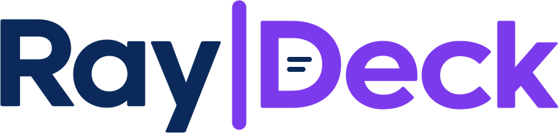

<div align="center">

<picture>
  <source media="(prefers-color-scheme: dark)" srcset="../docs/logos/raydeck-dark.svg">
  <source media="(prefers-color-scheme: light)" srcset="../docs/logos/raydeck.svg">
  
</picture>

**Turn Fabric data into concise, editable stories built to present.**

[](https://github.com/features/copilot)
[](https://learn.microsoft.com/en-us/fabric/apps/overview)
[](https://aka.ms/rayfin/docs)
[](https://www.typescriptlang.org/)

[&larr; Ray|Works](../README.md) &middot;
[Features](#features) &middot;
[Getting started](#getting-started) &middot;
[Private access](#private-fabric-access) &middot;
[Reference](#reference)

</div>

## Overview

Ray|Deck is a short-form presentation app built with
[Microsoft Fabric Apps](https://learn.microsoft.com/en-us/fabric/apps/overview) and
[Project Rayfin](https://aka.ms/rayfin/docs). It turns Fabric semantic-model visuals and editable
copy into a focused `3-10` slide narrative, with browser-local drafts and presenter tools.

## Features

- **Editable slide stories** - update titles and body copy directly in the shared 16:9 layout.
- **Automatic text fitting** - keep edits inside readable slide regions with explicit overflow
  warnings.
- **Fabric visuals** - render semantic-model data with Graphein chart specifications.
- **Browser-local drafts** - save changes locally and export precise reintegration prompts.
- **Speaker notes** - maintain private per-slide notes with adjustable display size.
- **Presentation modes** - single-window slideshow or presenter console with a synchronized
  audience window.
- **Presenter tools** - next-slide preview, resizable panes, navigation, themes, and an elapsed
  timer.

## Getting started

### Prerequisites

- Node.js 20.19+, 22.12+, or 24.x
- A Microsoft Fabric workspace with Fabric Apps enabled
- Access to the Fabric semantic model used by the deck

Install dependencies and deploy the protected app:

```bash
npm install
npm run rayfin:up
```

Open the sample locally against the active deployment:

```bash
npm run gallery
```

Use `npm run dev` for the full Rayfin deployment-and-Vite workflow.

## Private Fabric access

> [!WARNING]
> Every Ray|Deck surface requires Microsoft Fabric Entra SSO: editor, presenter console,
> slideshow, and audience window. Do not add public or anonymous deck access without explicit
> product and security approval.

- Static hosting uses `assetAccess: protected`; password and mock authentication remain disabled.
- Embedded Fabric sessions attempt silent SSO. Standalone windows use **Sign in with Microsoft**
  and restore the requested editor or audience role afterward.
- Audience windows are authenticated same-browser companions, not public share links.
- Browser-local drafts, notes, and view preferences survive sign-out. On a shared browser profile,
  the next authenticated user can see that local data.
- If the hosting platform ever serves the static bundle anonymously despite the protected
  posture, do not treat bundled content as confidential until the tenant policy is corrected.

Clear site data or reset the sample deck before signing out of a shared device.

## Editing and presenting

Edits to eyebrow, title, body, and speaker notes save in the browser. **Copy changes as prompt**
exports only changed fields with stable slide IDs and original/replacement values; it never
modifies source files or creates a commit. If storage fails, the current edits remain available
for prompt export.

<details>
<summary><strong>Draft and note behavior</strong></summary>

- The comparison baseline is the bundled deck in the running app, not a live Git checkout.
- Conflicting source values are reported instead of overwritten by the exported prompt.
- Notes are plain text, excluded from slides and audience messages, and not a security boundary
  against another user of the same browser.
- Note size and presenter layout are stored separately from deck content and are not exported.
- **Reset sample deck** explicitly replaces an unreadable or unwanted local draft.

</details>

<details>
<summary><strong>Presentation modes and audience recovery</strong></summary>

- **Present fullscreen** uses the current window and requests native fullscreen,
  with an in-window fallback when fullscreen is unavailable.
- **Present in this window** deliberately stays windowed while using the same
  distraction-free slide fitting, navigation, Exit behavior, and auto-hiding controls.
- **Enter presenter mode** keeps the console in one window and opens a synchronized audience
  window with current slide, next-slide preview, notes, controls, and timer.
- The presenter split is adjustable from `15-85%`, keyboard accessible, and remembered locally.
- Audience controls auto-hide but return on pointer, touch, or keyboard focus.
- A closed audience window can be reopened without stopping the timer.
- Unexpected connection loss freezes the last audience slide with an explicit notice.
- Popup blockers, sandboxing, or opener isolation can prevent the paired-window connection.

</details>

## Customize

The project workflow lives in [`.agents/skills/raydeck/SKILL.md`](.agents/skills/raydeck/SKILL.md)
and covers:

- company fonts, colors, logos, and chart palette;
- slide copy, order, layouts, notes, and sample data;
- Fabric semantic-model profiles in `fabric.yaml`;
- DAX queries and Graphein visual validation.

The app-local wordmarks and favicon are deployment copies of the canonical Ray|Works assets and
must remain byte-identical.

## Reference

### Commands

| Command | Description |
| --- | --- |
| `npm run gallery` | Generate active deployment env and open the private sample |
| `npm run dev` | Deploy Rayfin services and start Vite |
| `npm run build` | Type-check and create the production build |
| `npm run build:fabric` | Generate Fabric configuration and build without TypeScript checking |
| `npm run preview -- --spec <file>` | Render a Graphein spec to PNG and diagnostics |
| `npm test` | Run Vitest |
| `npm run lint` | Run ESLint |
| `npm run rayfin:up` | Deploy the protected app to Fabric |

Run `npm test`, `npm run lint`, and `npm run build` before deployment. `build:fabric` is not a
replacement for the checked build.

### Architecture

Rayfin data remains disabled. Deck content is browser-local, while analytics come from an
existing Fabric semantic model through the Fabric data and embed packages. Authentication and
protected static hosting secure every surface.

```text
.agents/skills/raydeck/SKILL.md  Branding, content, and Fabric workflow
fabric.yaml                       Semantic-model profiles
public/                           Canonical product assets
rayfin/rayfin.yml                 Auth and protected static hosting
src/deck/sampleDeck.ts            Bundled slide content and chart specs
src/components/Chart.tsx          Graphein React binding
src/global.css                    Visual tokens and layouts
```

Rayfin packages use the stable `1.35.1` baseline. Fabric data packages are pinned separately at
`1.0.0` or `1.1.0`; resolved versions live in `package-lock.json`. Client factories use the
configured absolute backend URL directly.

## More resources

- [Ray|Works design system](../DESIGN.md)
- [Ray|Works logo guide](../docs/logo.md)
- [Fabric Apps documentation](https://learn.microsoft.com/fabric/apps/)
- [Rayfin SDK documentation](https://aka.ms/rayfin/docs)
